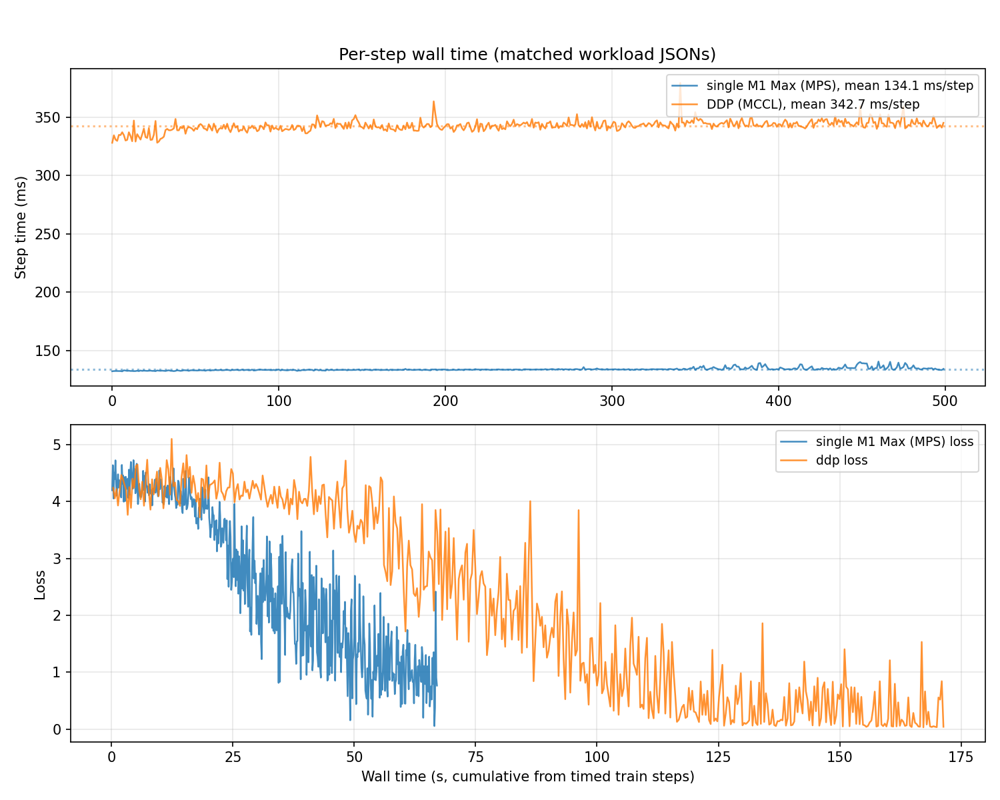
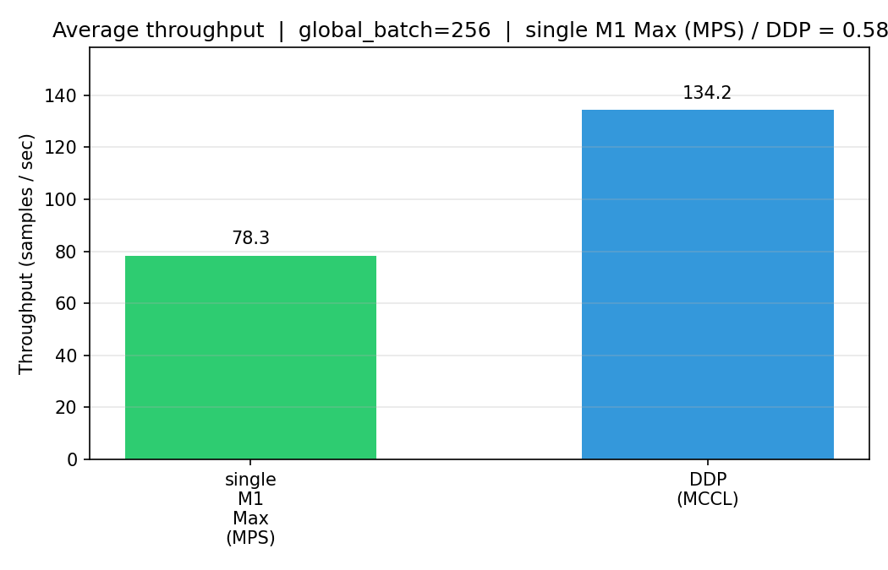

# MCCL

[](https://github.com/mps-ddp/mccl/actions/workflows/ci.yml)

MCCL registers a **`mccl`** backend for **`torch.distributed`** on **Apple Silicon (MPS)**.

Install PyTorch, then **`pip install mccl`**. **To our knowledge**, the first **`torch.distributed` backend** with **MPS DDP** (including multi-node). Same **`torchrun`** workflow; **`MASTER_ADDR`** on every node — [docs/MULTINODE.md](docs/MULTINODE.md). **TCP** by default; **RDMA** where supported.

## Requirements

- Apple Silicon Mac (arm64). No Intel.
- **Xcode Command Line Tools** — `xcode-select --install` (needed to compile the extension).
- **Full Xcode** — **optional for local `pip install -e .`**: without `xcrun metal`, the build skips the precompiled `mccl_shaders.metallib` but still installs **`shaders.metal`** next to `_C` for **runtime JIT**. For **PyPI releases**, CI sets **`MCCL_REQUIRE_METALLIB=1`** so wheels always include the `.metallib` (needs Xcode on the builder).
- **Python 3.11+**
- **`torch` (PyTorch) ≥2.5** and **`numpy` ≥1.20** — declared in [`pyproject.toml`](pyproject.toml) / [`requirements.txt`](requirements.txt); install `torch` first when building from source so headers/libs resolve.

## Install

```bash
pip install torch
pip install mccl
```

Source tree: `pip install -e ".[dev]"`. If the PyPI name `mccl` is taken, rename in `pyproject.toml` and `setup.py`.

Demo: https://github.com/user-attachments/assets/21865149-b077-4b65-93cc-f9e319ff0328

## Performance

**M4 Max** + **M1 Max**, TCP over Thunderbolt, global batch **256**, ~**96.5M** params — **~78** samples/s single-GPU vs **~134** samples/s MCCL DDP (2 ranks). Details and reproduce commands in [Throughput](#throughput) below.

  


## Examples

```bash
python examples/ddp_dummy_train.py --baseline
torchrun --nproc_per_node=2 --nnodes=1 --master_addr=127.0.0.1 --master_port=29500 \
  examples/ddp_dummy_train.py
```

Defaults there: DDP `BATCH_SIZE=128` per rank → global 256 with 2 ranks; baseline path uses global 256 unless you override. Shrink batch if you OOM.

Minimal DDP script (use `torchrun` as below). **Several Macs:** same pattern, `--nproc_per_node=1`, matching `--nnodes` / `--node_rank`, shared **`MASTER_ADDR`** / **`MASTER_PORT`**. Checklist: [docs/MULTINODE.md](docs/MULTINODE.md).

```python
import os
import torch
import torch.nn as nn
import torch.distributed as dist
from torch.nn.parallel import DistributedDataParallel as DDP
import mccl

def main():
    rank = int(os.environ["RANK"])
    world_size = int(os.environ["WORLD_SIZE"])
    device = torch.device("mps:0")

    dist.init_process_group(backend="mccl", device_id=device)

    torch.manual_seed(42)
    model = nn.Sequential(nn.Linear(512, 256), nn.ReLU(), nn.Linear(256, 10)).to(device)
    ddp_model = DDP(model)
    optimizer = torch.optim.AdamW(ddp_model.parameters(), lr=1e-3)
    loss_fn = nn.CrossEntropyLoss()

    for step in range(10):
        x = torch.randn(8, 512, device=device)
        y = torch.randint(0, 10, (8,), device=device)
        optimizer.zero_grad(set_to_none=True)
        loss_fn(ddp_model(x), y).backward()
        optimizer.step()
        if rank == 0:
            print(step, "ok")

    dist.destroy_process_group()

if __name__ == "__main__":
    main()
```

```bash
torchrun --nproc_per_node=2 --nnodes=1 --master_addr=127.0.0.1 --master_port=29500 your_train.py
```

## Throughput

One saved run, **M4 Max** + **M1 Max** MBPs, TCP over TB, global batch **256**, ~**96.5M** params. Your numbers will differ.

```
single M1 Max (MPS):   78.3 samples/s   (global_batch=256, world=1)
DDP (MCCL):          134.2 samples/s   (global_batch=256, world=2)
baseline / DDP:      0.58×  (~172% DDP vs baseline)
```

Tiny batches = comm noise dominates. Different chips on each rank = slowest one paces the step.

```bash
python examples/ddp_dummy_train.py --baseline --save-stats baseline_stats.json
torchrun --nproc_per_node=2 --nnodes=1 --master_addr=127.0.0.1 --master_port=29500 \
  examples/ddp_dummy_train.py --save-stats ddp_stats.json
python examples/benchmark_throughput.py --baseline baseline_stats.json --ddp ddp_stats.json -o bench
```

`bash scripts/benchmark_matrix.sh` for more sweeps.


## Collectives

`allreduce`, `broadcast`, `barrier`, `allgather`, `reduce_scatter`, `send`, `recv`

## Diagnostics

```python
mccl.get_metrics(); mccl.log_metrics(); mccl.reset_metrics()
```

Verbose startup: `MCCL_LOG_LEVEL=INFO`. Stuck multi-node: [docs/MULTINODE.md](docs/MULTINODE.md).

## Transport

Bench plots were TCP over a Thunderbolt-style link, not RDMA. Wi‑Fi/Ethernet work, just slower. TB wiring: [docs/THUNDERBOLT_SETUP.md](docs/THUNDERBOLT_SETUP.md). RDMA path exists on TB5-capable hardware + `librdma.dylib`; `rdma_ctl enable` from Recovery once; we didn’t use that for the graphs above.

## Internals

On Apple Silicon, **CPU and GPU use the same physical RAM** (unified memory architecture, **UMA**). Many MPS tensors sit in Metal **`MTLBuffer`** storage marked **shared**: the CPU can take a pointer (`buffer.contents`, see `extract_mps_buffer` in `MPSInterop.mm`) into the **same bytes** the GPU is using. MCCL uses that for send staging, receive `memcpy`, and **Accelerate/vDSP** work in `AccelerateOps.mm` without allocating a second host copy. For **fp32** + shared storage, ring **allreduce** **accumulates in place** into the tensor slice: inbound chunks hit a small recv buffer, then **vDSP** (`AccelerateOps.mm`) folds them into the **same** `cpu_ptr` the GPU uses, not a second full host tensor. **Private** GPU storage uses staging blits (`chunked_blit_*`) and **Metal** for the reduce path instead.

Network and staging run on a **background queue** (`ProgressEngine`, `csrc/runtime/`). **`commit_mps_and_signal`** / **`wait_for_mps`** (`EventSync.mm`) wait on a **Metal shared event** tied to PyTorch’s MPS command buffer so the worker does not read tensor memory while the GPU is still writing. `MCCL_EVENT_SYNC=0` disables that path and uses a stream sync instead. `ProcessGroupMCCL.cpp` wires jobs into the engine. More detail: [docs/DEVELOPING.md](docs/DEVELOPING.md).

## License

MIT — [LICENSE](LICENSE)